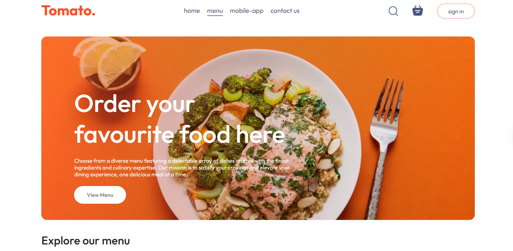
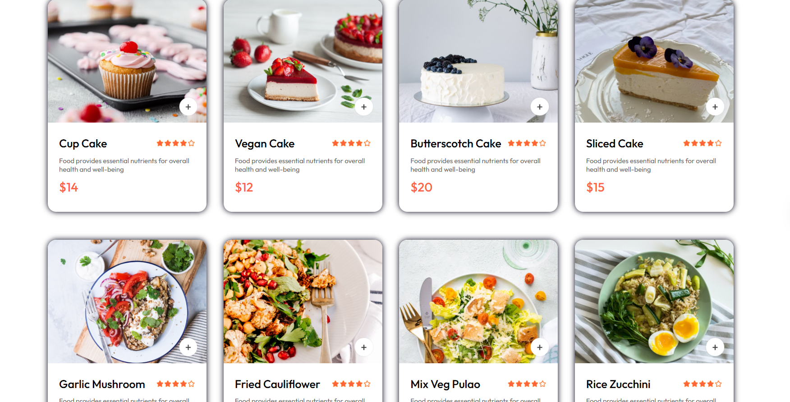
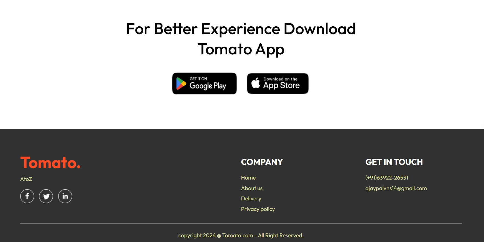
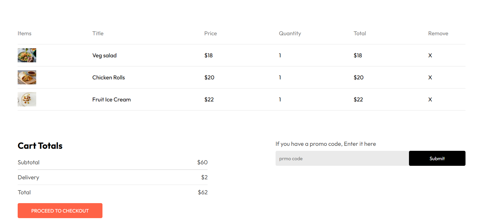
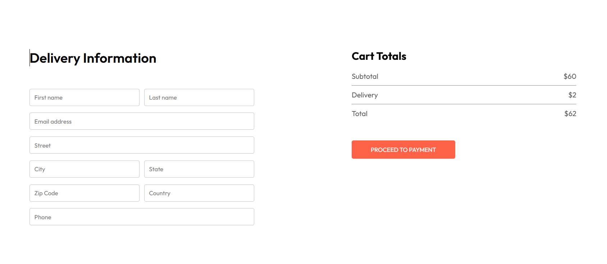
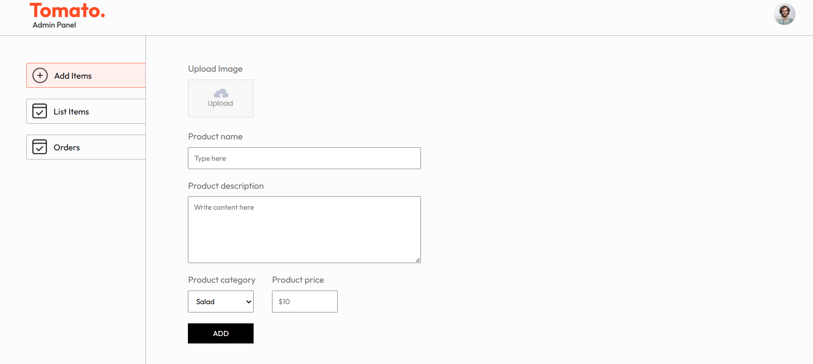

# 🍔 Food Order Website

A full-stack **Food Ordering Web Application** built using the **MERN Stack**.  
It allows users to browse restaurants and menus, place online food orders, and manage carts seamlessly with authentication and secure checkout.

---

## 🚀 Tech Stack

### Frontend
- React.js (with React Router & Context API / Redux for state management)
- Axios (for API communication)
- Tailwind CSS / Bootstrap (for styling)

### Backend
- Node.js
- Express.js
- RESTful APIs

### Database
- MongoDB (Mongoose ODM)

### Tools
- Postman (API testing)
- JWT (Authentication)
- Git & GitHub (Version control)

---

## ✨ Features

- 👤 **User Authentication** – Sign up / Login with JWT  
- 🍽️ **Browse Menu** – View restaurants and food items  
- 🔎 **Search & Filter** – Find food items quickly  
- 🛒 **Cart Management** – Add, update, and remove items from cart  
- 💳 **Checkout Process** – Place orders with order summary  
- 📦 **Order Tracking (Optional)** – Track order status  
- 🛠️ **Admin Panel (Optional)** – Manage food items, categories, and orders  

---

## 📂 Project Structure

 food-order-app/  
│  
├── backend/ # Node.js + Express backend  
│ ├── models/ # MongoDB models  
│ ├── routes/ # API routes  
│ ├── controllers/ # Business logic  
│ ├── server.js # Entry point  
│ └── package.json # Dependencies  
│  
├── frontend/ # React frontend  
│ ├── src/ # Components, pages, services  
│ ├── public/ # Static assets  
│ └── package.json # Dependencies

---
## 💻 Getting Started 
 
### 1️⃣ Clone the Repository

     git clone https://github.com/ajayp9/FoodApp.git
     cd FoodApp
---
### 2️⃣ Backend Setup
    cd backend
    npm install
     //Create a .env file and add MongoDB URI + JWT secret
    npm start
---
### 3️⃣ Frontend Setup
     cd frontend
     npm install
     npm start
---
## 🔐 Environment Variables
  
  PORT=5000
  MONGO_URI=your_mongodb_connection_string
  JWT_SECRET=your_jwt_secret

---
## 📸 Screenshots
🏠 Home Page
### 🎬 Demo
   
   
---
### 🎬 Demo
  

---
### 🎬 Demo
  

---
### 🎬 Demo
  

---
### 🎬 Demo
  

---
### 🎬 Demo
  

---
### 🎬 Demo
  

---
## 🛠️ Future Improvements
-   Integrate Payment Gateway (Stripe/PayPal)
    
-   Live Order Tracking with WebSockets
    
-   Restaurant Management Dashboard
    
-   Mobile App version with React Native

---
## 🤝 Contributing
 Contributions are welcome! Please fork this repository and submit a pull request.

